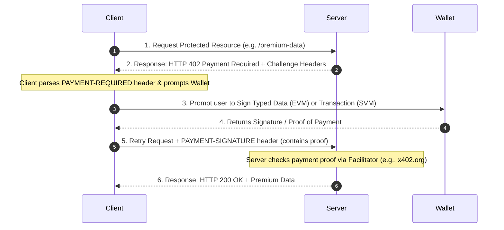

# x402 Protocol and Dummy Paid Service Explanation

**Date:** 2026-06-11

This document explains the **x402 Payment Protocol** and the implementation of the **Dummy Paid Service** within the Vaulta wallet application.

---

## 1. What is the x402 Protocol?

The **x402 Protocol** is an open standard that leverages the standard, but historically unused, HTTP **402 Payment Required** status code to enable pay-per-use, machine-to-machine (M2M), and AI agent micropayments.

Instead of registering user accounts, setting up monthly credit card subscriptions, or managing API keys, the client pays for each API call dynamically using stablecoins (like USDC) directly from their cryptocurrency wallets (MetaMask, Phantom, etc.).

### How the Flow Works:



1. **Initial Request:** The client makes a standard HTTP request to a protected endpoint.
2. **Challenge (402):** The server intercepts the request using `paymentMiddleware` and responds with an `HTTP 402 Payment Required` status. It embeds the challenge configuration (network, price, accepted token, and destination address) inside the `payment-required` header (base64 encoded JSON).
3. **Signing / Payment:** The client (wrapped using `@x402/fetch` or `@x402/client`) catches the 402. It prompts the user's wallet (e.g. MetaMask or Phantom) to sign the payment payload corresponding to the requirements.
4. **Retry:** The client automatically retries the original request, attaching the signed proof in the `payment-signature` header.
5. **Verification:** The server validates the proof on-chain (or using a public facilitator like `x402.org` for gasless/fast verification).
6. **Resource Granted:** The server finishes execution and returns the gated resource with an `HTTP 200 OK` status.

---

## 2. Supported Networks and Tokens in Development

In our development environment, the following networks and testnet stablecoins are configured:

- **EVM (Base Sepolia Testnet):** 
  - Chain ID: `eip155:84532`
  - Asset: Testnet USD Coin (USDC) Contract: `0x036CbD53842c5426634e7929541eC2318f3dCF7e`
- **Solana Devnet:**
  - Network ID: `solana:EtWTRABZaYq6iMfeYKouRu166VU2xqa1`
  - Asset: Testnet USD Coin (USDC) Mint: `4zMMC9srt5Ri5X14GAgXhaHii3GnPAEERYPJgZJDncDU`

We utilize the public testnet facilitator `https://x402.org/` to verify these signatures and confirm settlement without local node overhead.

---

## 3. Dummy Paid Service Implementation

The **Dummy Paid Service** is a mock pay-per-use endpoint that demonstrates the end-to-end x402 protocol in action.

### Server Implementation (`/dummy-paid-service`):
- Gated behind `paymentMiddleware`.
- Requires a payment of **$0.05 USDC** on Base Sepolia or **$0.005 USDC** on Solana Devnet.
- Once the payment signature is successfully verified by the `x402ResourceServer`, the handler executes and returns a success response:
  ```json
  { 
      "success": true, 
      "result": "Dummy Paid Service has run successfully! Fueling the Web3 micro-economy." 
  }
  ```

### Client Implementation:
- Located on the `/x402-client` route.
- Connecting MetaMask or Phantom maps to the respective x402 Evm/Svm Signers.
- Clicking **Invoke Dummy Service** triggers the payment flow. The client wallet requests signature confirmation. Upon user approval, the payload is sent, and the dummy service result is printed to the interactive console.
